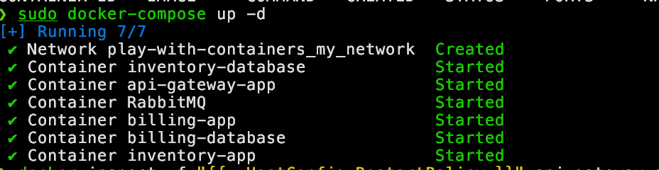
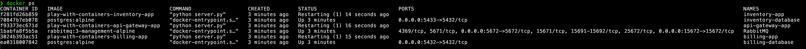
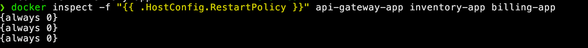
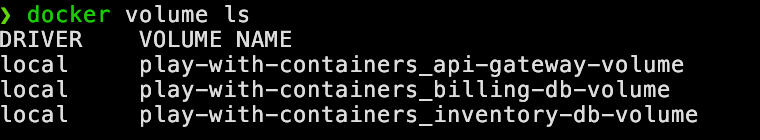
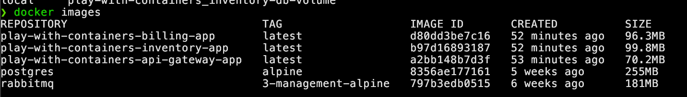

## Configuration for using the project

#### Clone the repository
```bash
git clone git@github.com:DIGIX666/play-with-container.git
cd play-with-container
```

#### Prerequisites
- [Docker](https://docs.docker.com/get-docker/)
- [Docker-compose](https://docs.docker.com/compose/install/)

#### Create a `.env` file
```bash
Change .env.example to .env and modify the values as needed
```
#### Build the Docker containers
```bash
docker-compose build
```

#### Run the Docker containers
```bash
docker-compose up -d or docker-compose up
```
*`-d` is for running Docker in the background*

---

> ### Answer to the questions:
#### ***What are containers and what are their advantages?***
```
Containers are lightweight environments that contain everything an application needs to run, such as its code and dependencies. This makes them easy to move from one machine to another. 
The main advantages of containers are:

    - Isolation -> Each container is separated from the others, which improves security and prevents conflicts.
    
    - Portability -> You can run a container anywhere Docker is installed, ensuring it works the same way in any environment.

    - Efficiency -> Containers use fewer resources because they share parts of the operating system, unlike virtual machines that each have their own OS.
```

#### ***What is the difference between containers and virtual machines?***
```
Containers and virtual machines both virtualize applications, but they work differently:

Containers -> They share the host operating system and are much lighter. They start faster and use fewer resources.

Virtual Machines (VMs) -> They have their own complete operating system, making them heavier but also more isolated and independent.
```

#### ***What is Docker and what is it used for?***
```
Docker is a tool that allows you to create and manage containers. With Docker, you can easily package an application and all its dependencies, then deploy it anywhere without worrying about differences in environments.
```

> ### Infrastructure


---

> ### Answer to the questions:
#### ***What is a microservices architecture?***
```
A microservices architecture is a way to develop an application by dividing it into several small, independent parts called services. Each service performs a specific task.
```

#### ***Why do we use microservices architecture?***
```
It makes the application easier to maintain and update. If one service has a problem, it doesn't affect the others. Each service can also be developed and deployed independently.
```

#### ***What is a queue and what is it used for?***
```
A queue is a system that stores messages between different services so they can communicate. It helps avoid overloading services by managing messages at their own pace.
```

#### ***What is a Dockerfile?***
```
A Dockerfile is a file that contains the instructions to create a Docker image. It's like a recipe that shows how to build a container.
```

#### ***Explain the instructions used in the Dockerfile.***
```
Common instructions include:
- FROM -> Specifies the base image to use.
- RUN -> Executes commands during the creation of the image.
- COPY -> Copies files into the image.
- CMD -> Specifies the command to run when the container starts.
```

> ### Docker ps


> ### Restarting a container


----

> ### Docker Volume


#### ***What is a Docker volume?***
```
A Docker volume is a storage space used by containers to save data. It allows you to keep data even if the container is removed.
```

#### ***Why do we use Docker volumes?***
```
Volumes allow us to keep data outside of the container, which is useful to avoid losing information when the container is stopped or removed.
```

#### ***What is a Docker network?***
```
A Docker network is a connection that allows containers to communicate with each other. Docker automatically creates a network so that containers can find and talk to each other.
```

#### ***Why do we use Docker networks?***
```
The Docker network makes it easier for different services of the application, like a database and a web application, to communicate. This makes the connection simple and secure.
```

---

> ### Docker Images


#### ***What is a Docker image?***
```
A Docker image is a template used to create containers. It contains everything needed to run an application, like code, libraries, and the operating system.
```

#### ***Why do we use Docker images?***
```
A Docker image is a model used to create containers. It contains everything needed to run an application, such as code, libraries, and the operating system.
```